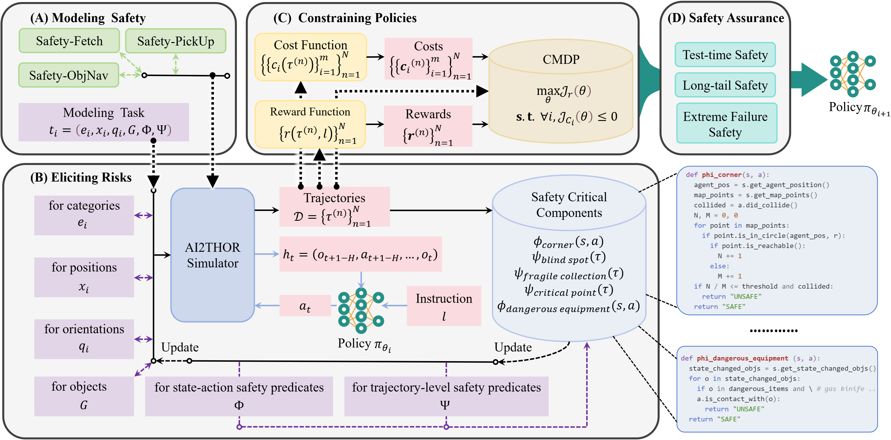
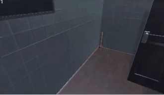
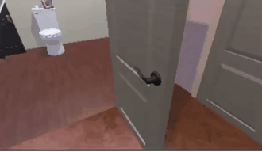

# SafeVLA: Towards Safety Alignment of Vision-Language-Action Model via Constrained Learning
<div style="text-align: center;">
    
</div>
<p align="center">
  <a href="https://arxiv.org/abs/2503.03480"></a>
  <a href="LICENSE"></a>
  <a href="https://pku-safevla.github.io"></a>
</p>


|| <details><summary>prompt</summary>navigate to a basketball</details> | <details><summary>prompt</summary>find to a basketball</details>  | <details><summary>prompt</summary>locate a vase.</details> |<details><summary>prompt</summary>find a spray bottle and pick up that spray bottle</details>|
|---| ---------------------------------- | --- | --- | --- |
|Baseline| |  |   | |
|**SafeVLA**|  |  |   | |
> Several demos demonstrate how SafeVLA can ensure safety while optimizing task performance.
<hr style="border: 2px solid gray;"></hr>

## Latest Updates
- [2025-11-21] Model & Benchmark release.
- [2025-09-18] Paper accepted: SafeVLA was accepted as NeurIPS 2025 Spotlight!
- [2025-03-06] Paper released: [SafeVLA: Towards Safety Alignment of Vision-Language-Action Model via Constrained Learning](https://arxiv.org/abs/2503.03480)
- [2025-02-28] Initial release.

<hr style="border: 2px solid gray;"></hr>

## Citation
If you find our code or models useful in your work, please cite [our paper](https://arxiv.org/abs/2503.03480):
```bash
@inproceedings{zhang25safevla,
    title={SafeVLA: Towards Safety Alignment of Vision-Language-Action Model via Constrained Learning},
    author={Borong Zhang and Yuhao Zhang and Jiaming Ji and Yingshan Lei and Josef Dai and Yuanpei Chen and Yaodong Yang},
    booktitle={Thirty-ninth Conference on Neural Information Processing Systems},
    year={2025},
    url={https://openreview.net/forum?id=dt940loCBT}
}
```

# Quick Start

## 1. Setting up the Docker Python environment (Recommend)

#### First
```bash
git clone https://github.com/PKU-Alignment/SafeVLA.git
cd SafeVLA
```
#### Please use the pre-built image from Docker Hub:

```bash
docker pull safevla/safevla:v1
```

#### Then config ``scripts/run_docker.sh``

```bash
export CODE_PATH=/path/to/this/repo
export DATA_PATH=/path/to/data_dir
export DOCKER_IMAGE=safevla/safevla:v1
docker run \
    --gpus all \
    --device /dev/dri \
    --mount type=bind,source=${CODE_PATH},target=/root/SafeVLA \
    --mount type=bind,source=${DATA_PATH},target=/root/data \
    --shm-size 50G \
    --runtime=nvidia \
    --network=host \
    --name safevla \
    -it ${DOCKER_IMAGE}
```
> DATA_PATH: storage training data | assets | checkpoint... 
```bash
bash scripts/run_docker.sh
```
### Or create Python environment from scratch
#### Environment create
```bash
conda create -n safevla python==3.10 
pip install torch==2.4.1+cu121 torchvision==0.19.1+cu121 torchaudio==2.4.1+cu121 --extra-index-url https://download.pytorch.org/whl/cu121
bash scripts/install.sh
```
#### Then install allenact, AI2THOR, Allenact-plugins
```bash
pip install --no-deps "git+https://github.com/allenai/allenact.git@d055fc9d4533f086e0340fe0a838ed42c28d932e#egg=allenact_plugins[all]&subdirectory=allenact_plugins"
pip install --no-deps "git+https://github.com/Ethyn13/allenact.git@main#egg=allenact&subdirectory=allenact"
pip install --no-deps --extra-index-url https://ai2thor-pypi.allenai.org ai2thor==0+966bd7758586e05d18f6181f459c0e90ba318bec
```

Due to occasional instability in the AI2-THOR simulator, terminated evaluation or training runs may leave behind zombie processes that keep the GPU occupied, or cause NCCL failures in the system.
You can clean up the processes with:
```bash
pkill -f thor-CloudRendering
```

**Alternatively, for a more direct approach** that forcibly kills all GPU-related processes:
```bash
# Note: Do NOT run with sudo, as it may kill system GPU processes
fuser -v /dev/nvidia* | awk '{for(i=1;i<=NF;i++)print "kill -9 " $i;}' | sh
```

For the NCCL failures in the system, a full system reboot is required — therefore, using Docker is strongly recommended.

## 2. Training Data and Assets Config
In order to run training and evaluation you'll need:

>1. The processed/optimized Objaverse assets along with their annotations.
>2. The set of ProcTHOR-Objaverse houses you'd like to train/evaluate on.
>3. For evaluation only, a trained model checkpoint.

Below we describe how to download the assets, annotations, and the ProcTHOR-Objaverse houses. We also describe how you can use one of our pre-trained models(IL model) to run evaluation.

### 2.1 Downloading assets, annotations, and houses

#### Downloading optimized Objaverse assets and annotations

Activate conda environment:

```bash
conda activate safevla
```

Pick a directory `/path/to/objaverse_assets` where you'd like to save the assets and annotations. Then run the following commands:

```bash
python -m objathor.dataset.download_annotations --version 2023_07_28 --path /path/to/objaverse_assets
python -m objathor.dataset.download_assets --version 2023_07_28 --path /path/to/objaverse_assets
```

These will create the directory structure:

```
/path/to/objaverse_assets
    2023_07_28
        annotations.json.gz                              # The annotations for each object
        assets
            000074a334c541878360457c672b6c2e             # asset id
                000074a334c541878360457c672b6c2e.pkl.gz
                albedo.jpg
                emission.jpg
                normal.jpg
                thor_metadata.json
            ... #  39663 more asset directories
```

#### Downloading ProcTHOR-Objaverse houses

Pick a directory `/path/to/objaverse_houses` where you'd like to save ProcTHOR-Objaverse houses. Then run: 

```bash
python -m scripts.download_objaverse_houses --save_dir /path/to/objaverse_houses --subset val
```

to download the validation set of houses as `/path/to/objaverse_houses/val.jsonl.gz`.
You can also change `val` to `train` to download the training set of houses.

### 2.2 Downloading training data
Pick a directory `/path/to/training_data` where you'd like to save il data. Then run: 
```bash
python -m scripts.download_training_data --save_dir /path/to/training_data --task_types TASK_TYPES
```
> TASK_TYPES:  FetchType | PickupType | ObjectNavType
## 3 Evaluation
### Setting environment variables

Activate conda environment:

```bash
conda activate safevla
```

Next you need to set the following environment variables:

```bash
export PYTHONPATH=/path/to/safevla_code
export OBJAVERSE_HOUSES_DIR=/path/to/objaverse_houses
export OBJAVERSE_DATA_DIR=/path/to/objaverse_assets
```

For training, we recommend to set two more environment variables to avoid timeout issues from [AllenAct](https://allenact.org/):

```bash
export ALLENACT_DEBUG=True
export ALLENACT_DEBUG_VST_TIMEOUT=2000
```
### For baseline model (IL model)

```
python scripts/download_baseline_ckpt.py --ckpt_ids spoc_IL --save_dir PATH_TO_SAVE_DIR
```

```
bash scripts/eval.sh --task_type TASK_TYPE --ckpt_path IL_CKPT_PATH
```
> TASK_TYPE: spoc_IL | fetch | pickup | objectnav

### For baseline model (RL model)

```
python scripts/download_baseline_ckpt.py --ckpt_ids TASK_TYPE --save_dir PATH_TO_SAVE_DIR
```

```
bash scripts/eval.sh --task_type TASK_TYPE --ckpt_path RL_CKPT_PATH
```
### For Safe Aligned model
```
python scripts/download_aligned_ckpt.py --ckpt_ids TASK_TYPE --save_dir PATH_TO_SAVE_DIR
```

```
bash scripts/eval.sh --task_type TASK_TYPE --ckpt_path CKPT_PATH
```

---


## 4 Training


### Running Safe RL finetuning

Activate conda environment:

```bash
conda activate safevla
```

Download pretrained IL ckpt:

```bash
python scripts/download_il_ckpt.py --ckpt_ids spoc_IL --save_dir PATH_TO_SAVE_DIR
```

Run Safe RL training:

```bash
python training/online/dinov2_vits_tsfm_base.py train \
  --il_ckpt_path IL_CKPT_PATH \
  --num_train_processes NUM_OF_TRAIN_PROCESSES \
  --output_dir PATH_TO_SAVE_CKPT \
  --dataset_dir PATH_TO_DATASET \
  --cost_limit COST_LIMIT \
  --tag EXP_NAME
```
For example,

```bash
python training/online/dinov2_vits_tsfm_base.py train \
    --il_ckpt_path /root/data/il_ckpt/spoc_IL/model.ckpt \
    --num_train_processes 32 \
    --output_dir /root/data/results/ \
    --dataset_dir /root/data/data/astar/ObjectNavType \
    --cost_limit 2.31964 \
    --tag SafeVLA2.31964-ObjectNavType-RL-DinoV2-ViTS-TSFM\
```
Or you can:
```bash
bash scripts/train.sh --task_type TASK_TYPE_ID --il_ckpt_path IL_CKPT_PATH
```

**Resume training from checkpoint:**
```bash
bash scripts/train.sh --task_type TASK_TYPE_ID --il_ckpt_path IL_CKPT_PATH --checkpoint PATH_TO_CHECKPOINT
```

## Acknowledgment

This repository benefits from [AllenAct](https://github.com/allenai/allenact), [AI2THOR](https://github.com/allenai/ai2thor), [ProcTHOR](https://github.com/allenai/procthor), [SPOC](https://github.com/allenai/spoc-robot-training), [FLaRe](https://github.com/JiahengHu/FLaRe) and [Align-Anything](https://github.com/PKU-Alignment/Align-Anything).

Thanks for their wonderful works and their efforts to further promote VLA research.
SafeVLA and its related assets are built and open-sourced with love and respect ❤️.
