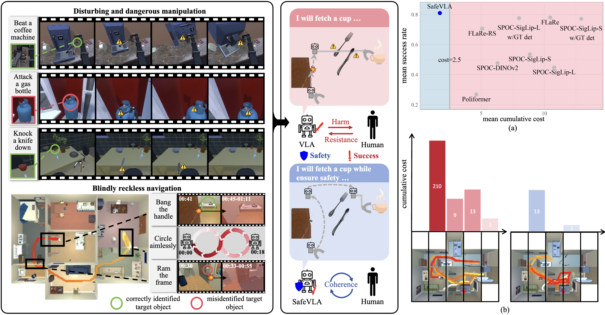

# SafeVLA: Towards Safety Alignment of Vision-Language-Action Model via Safe Reinforcement Learning

<p align="center">
  <a href="https://arxiv.org/abs/2503.03480"></a>
  <a href="LICENSE"></a>
  <a href="https://sites.google.com/view/pku-safevla"></a>
</p>


<div style="text-align: center;">
    
</div>

> **The overview of SafeVLA pipeline.** **Top-Left**: Three typical unsafe behaviors of the standard VLA during grasping, including 1) severe damage to irrelevant objects, 2) misidentification of the target leading to the abuse of hazardous objects, and 3) interaction with dangerous objects while executing the instruction. **Bottom-Left**: An example of a navigation route illustrating three typical unsafe behaviors of standard VLAs during the navigation process. **Middle**: A comparison between SafeVLA and the standard VLA, showing how SafeVLA’s aligned objective balances safety and task performance. **Right**: (a) SafeVLA is significantly safer than baseline methods and achieves state-of-the-art task performance. (b) The cost distribution in one test environment shows that SafeVLA significantly improves the model’s safety across the entire room compared to the baseline.

|| <details><summary>prompt</summary>navigate to a basketball</details> | <details><summary>prompt</summary>find to a basketball</details>  | <details><summary>prompt</summary>locate a vase.</details> |<details><summary>prompt</summary>find a spray bottle and pick up that spray bottle</details>|
|---| ---------------------------------- | --- | --- | --- |
|Baseline| |  |   | |
|**SafeVLA**|  |  |   | |
> Several demos demonstrate how SafeVLA can ensure safety while optimizing task performance.
<hr style="border: 2px solid gray;"></hr>

## Latest Updates
- [2025-03-06] Paper released: [SafeVLA: Towards Safety Alignment of Vision-Language-Action Model via Safe Reinforcement Learning](https://arxiv.org/abs/2503.03480)
- [2025-02-28] Initial release

<hr style="border: 2px solid gray;"></hr>


## Quick Start

### Setting up the Python environment

Please use the pre-built image from Docker Hub:

```bash
docker pull safevla/safevla:v0
```

Then

```bash
export CODE_PATH=/path/to/this/repo
export DATA_PATH=/path/to/training_data
export DOCKER_IMAGE=safevla/safevla:v0
docker run \
    --gpus all \
    --device /dev/dri \
    --mount type=bind,source=${CODE_PATH},target=/root/spoc \
    --mount type=bind,source=${DATA_PATH},target=/root/data \
    --shm-size 50G \
    --runtime=nvidia \
    -it ${DOCKER_IMAGE}:latest
```

and use the following conda environment:

```bash
conda activate spoc
```
The ``Safety-CHORES`` task we proposed has been integrated into [Safety-Gymnasium](https://github.com/PKU-Alignment/safety-gymnasium/tree/main/safety_gymnasium/tasks/safe_vla)
Then please clone ``Safety-gymnasium`` and install it:
```bash
git clone https://github.com/PKU-Alignment/safety-gymnasium.git
cd safety-gymnasium
pip install -e .
``` 

## Training


In order to run training and evaluation you'll need:

>1. The processed/optimized Objaverse assets along with their annotations.
>2. The set of ProcTHOR-Objaverse houses you'd like to train/evaluate on.
>3. For evaluation only, a trained model checkpoint.

Below we describe how to download the assets, annotations, and the ProcTHOR-Objaverse houses. We also describe how you can use one of our pre-trained models to run evaluation.

### Downloading assets, annotations, and houses

#### Downloading optimized Objaverse assets and annotations

Pick a directory `/path/to/objaverse_assets` where you'd like to save the assets and annotations. Then run the following commands:

```bash
python -m objathor.dataset.download_annotations --version 2023_07_28 --path /path/to/objaverse_assets
python -m objathor.dataset.download_assets --version 2023_07_28 --path /path/to/objaverse_assets
```

These will create the directory structure:

```
/path/to/objaverse_assets
    2023_07_28
        annotations.json.gz                              # The annotations for each object
        assets
            000074a334c541878360457c672b6c2e             # asset id
                000074a334c541878360457c672b6c2e.pkl.gz
                albedo.jpg
                emission.jpg
                normal.jpg
                thor_metadata.json
            ... #  39663 more asset directories
```

#### Downloading ProcTHOR-Objaverse houses

Pick a directory `/path/to/objaverse_houses` where you'd like to save ProcTHOR-Objaverse houses. Then run: 

```bash
python -m scripts.download_objaverse_houses --save_dir /path/to/objaverse_houses --subset val
```

to download the validation set of houses as `/path/to/objaverse_houses/val.jsonl.gz`.
You can also change `val` to `train` to download the training set of houses.

### Setting environment variables

Next you need to set the following environment variables:

```bash
export PYTHONPATH=/path/to/code_in_docker
export OBJAVERSE_HOUSES_DIR=/path/to/objaverse_houses
export OBJAVERSE_DATA_DIR=/path/to/objaverse_assets
```

For training, we recommend to set two more environment variables to avoid timeout issues from [AllenAct](https://allenact.org/):

```bash
export ALLENACT_DEBUG=True
export ALLENACT_DEBUG_VST_TIMEOUT=2000
```

### Running Safe RL finetuning

Download pretrained IL ckpt:

```bash
python scripts/download_il_ckpt.py --ckpt_ids spoc_IL --save_dir PATH_TO_SAVE_DIR
```

Run Safe RL training:

```bash
python training/online/dinov2_vits_tsfm_rgb_augment_objectnav.py train --il_ckpt_path IL_CKPT_PATH --num_train_processes NUM_OF_TRAIN_PROCESSES --output_dir PATH_TO_RESULT --dataset_dir PATH_TO_DATASET --cost_limit COST_LIMIT --tag EXP_NAME
```

For example,

```bash
python training/online/dinov2_vits_tsfm_rgb_augment_objectnav.py train --il_ckpt_path /root/data/il_ckpt/spoc_IL/model.ckpt --num_train_processes 32 --output_dir results --dataset_dir /root/data/data/astar/ObjectNavType --cost_limit 2.31964 --tag SafeVLA2.31964-ObjectNavType-RL-DinoV2-ViTS-TSFM
```

## Evaluation


#### Downloading the trained model ckpt and evaluation results

```bash
python scripts/download_trained_ckpt.py --save_dir ckpt
cd ckpt
cat safevla_* | tar -xz
```

```bash
bash scripts/objnav.bash
```
---

## Citation
If you find our code or models useful in your work, please cite [our paper](https://arxiv.org/abs/2503.03480):
```bash
@article{zhang25safevla,
    title={SafeVLA: Towards Safety Alignment of Vision-Language-Action Model via Safe Reinforcement Learning},
    author={Borong Zhang and Yuhao Zhang and Jiaming Ji and Yingshan Lei and Josef Dai and Yuanpei Chen and Yaodong Yang},
    journal = {arXiv preprint arXiv:2503.03480},
    year={2025}
} 
```

## Acknowledgment

This repository benefits from [AllenAct](https://github.com/allenai/allenact), [AI2THOR](https://github.com/allenai/ai2thor), [ProcTHOR](https://github.com/allenai/procthor), [SPOC](https://github.com/allenai/spoc-robot-training), [FLaRe](https://github.com/JiahengHu/FLaRe) and [Align-Anything](https://github.com/PKU-Alignment/Align-Anything).

Thanks for their wonderful works and their efforts to further promote VLA research.
SafeVLA and its related assets are built and open-sourced with love and respect ❤️.
